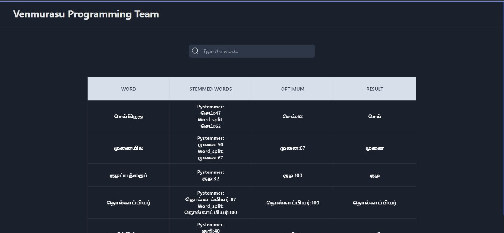

# Venmurasu Site Indexing

A web application for indexing and searching content from Venmurasu, a Tamil literary work. This project implements custom indexing algorithms optimized for Tamil language processing.



## 📋 Overview

This project consists of a full-stack application with:
- **Backend**: Python-based indexing engine with custom algorithms for Tamil text
- **Frontend**: React-based search interface for exploring indexed content

## 🚀 Features

- **Tamil Text Indexing**: Specialized algorithms for Tamil language processing
- **Word Splitting**: Advanced techniques for handling Tamil compound words
- **Search Optimization**: Fast retrieval of indexed content
- **Efficiency Metrics**: Tools for measuring and improving search quality
- **Web Interface**: User-friendly search portal for Venmurasu content

## ⚙️ Technical Architecture

The application is built with:
- **Backend**: Python Flask server
- **Frontend**: React.js application
- **Algorithms**: Custom indexing and word-splitting implementations
- **Performance Analysis**: Jupyter notebooks for testing and metrics

## 🔧 Installation and Setup

### Prerequisites
- Python 3.7+
- Node.js and npm
- PowerShell (for Windows users) or equivalent terminal

### Starting the Project

1. **Clone the repository**
   ```
   git clone https://github.com/Mhdd-24/VPT.ai-Intern-Overflow.git
   cd venmurasu-site-indexing
   ```

2. **Run the backend server**
   ```powershell
   cd backend
   python main.py
   ```
   The backend server will start at http://localhost:5000

3. **Start the frontend application**
   ```powershell
   cd frontend
   npm install
   npm start
   ```
   The frontend application will be available at http://localhost:3000

## 🔍 Usage

1. Navigate to http://localhost:3000 in your web browser
2. Enter Tamil text or keywords in the search field
3. View the indexed results and related content
4. Use the interface to explore Venmurasu content

## 📊 Testing and Performance

The `testing` directory contains Jupyter notebooks for:

- **Venmurasu_Indexing.ipynb**: Legacy testing and algorithm implementation
- **WordSplitting.ipynb**: Code specific to the word splitting algorithm
- **Indexing_Metrices.ipynb**: Tools for calculating the efficiency of search results

To run these notebooks:
```
jupyter notebook testing/Venmurasu_Indexing.ipynb
```

## 📈 Performance Metrics

The indexing algorithm's performance is measured by:
- Search result relevance
- Query processing time
- Memory usage efficiency
- Word splitting accuracy

## 🛠️ Technical Details

### Backend
- Flask API endpoints for indexing and search
- Custom Tamil language processing modules
- Optimized storage and retrieval mechanisms

### Frontend
- React-based user interface
- Real-time search suggestions
- Result highlighting and navigation
- Mobile-responsive design

### Algorithms
- N-gram based indexing for Tamil text
- Context-aware word splitting
- Relevance scoring algorithms
- Memory-efficient index storage

## 🤝 Contributing

Contributions to improve the indexing algorithm or extend functionality are welcome:

1. Fork the repository
2. Create a feature branch: `git checkout -b feature/amazing-feature`
3. Commit your changes: `git commit -m 'Add some amazing feature'`
4. Push to the branch: `git push origin feature/amazing-feature`
5. Open a Pull Request

## 📚 Project Background

Venmurasu is a modern Tamil novel series written by Jeyamohan, based on the Indian epic Mahabharata. This project aims to make the vast literary content more accessible through advanced search and indexing capabilities.

## 📝 License

[Your license information here]

## 👥 Team

- [Mohammed Rafi](https://github.com/Mhdd-24)

## 📞 Contact

For questions or support, please contact [mhdd24.rafi@gmail.com]